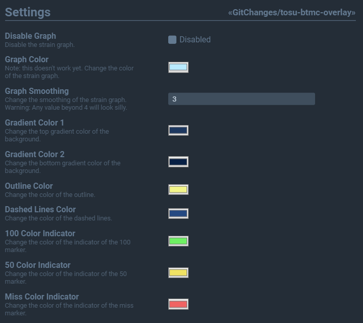

# BTMC - Stream overlay designed for tosu

A tosu overlay created and designed for BTMC (twitch.tv/BTMC) by happpy24

### Find tosu here: https://github.com/KotRikD/tosu

## Use Case

|                 |                     |
| --------------- | ------------------- |
| For             | ingame, obs-overlay |
| Compatible with | tosu                |
| Size            | 584 x 184           |

## Customizable!

This overlay is _really_ customizable. In tosu, there will be a settings tab for you to play with all sorts of settings!

## With help from

-   [CaptSiro](https://github.com/CaptSiro): Created and styled everything from the Graph used
-   [Xen-000](https://github.com/xen-000): Added finishing touches, state checking & better animations
-   [GabuTheDev](https://github.com/GabuTheDev): Added dynamic color changes on beatmap stats
-   [L1teD](https://github.com/L1teD): Helped with padding/margin fixes accross the overlay
-   [Plextora](https://github.com/Plextora): Added a toggle for showing Max-PP / PP-if-FC
-   [AutumnVN](https://github.com/AutumnVN): Made sure in-game overlay works
